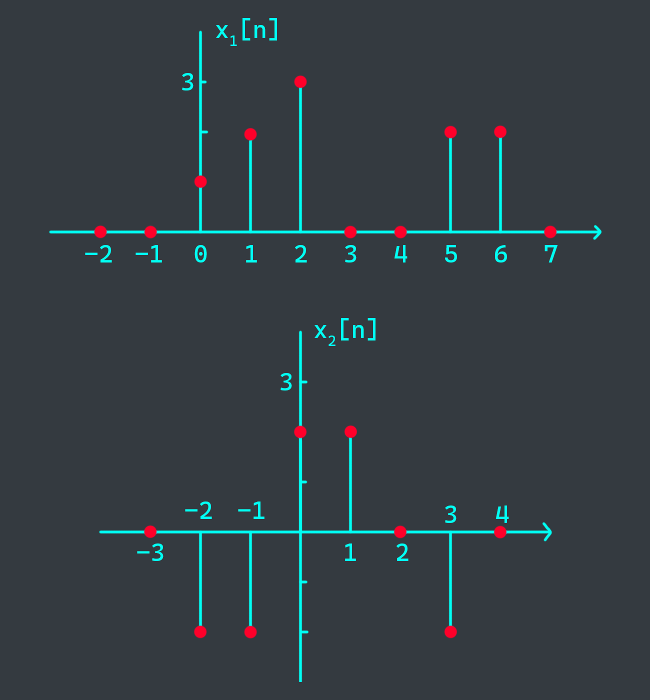
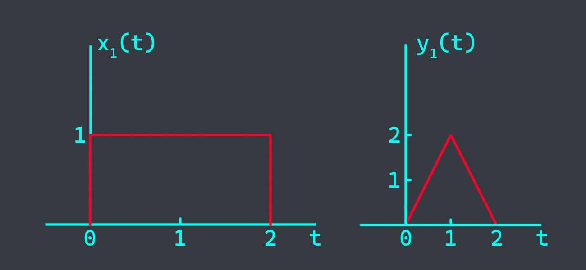
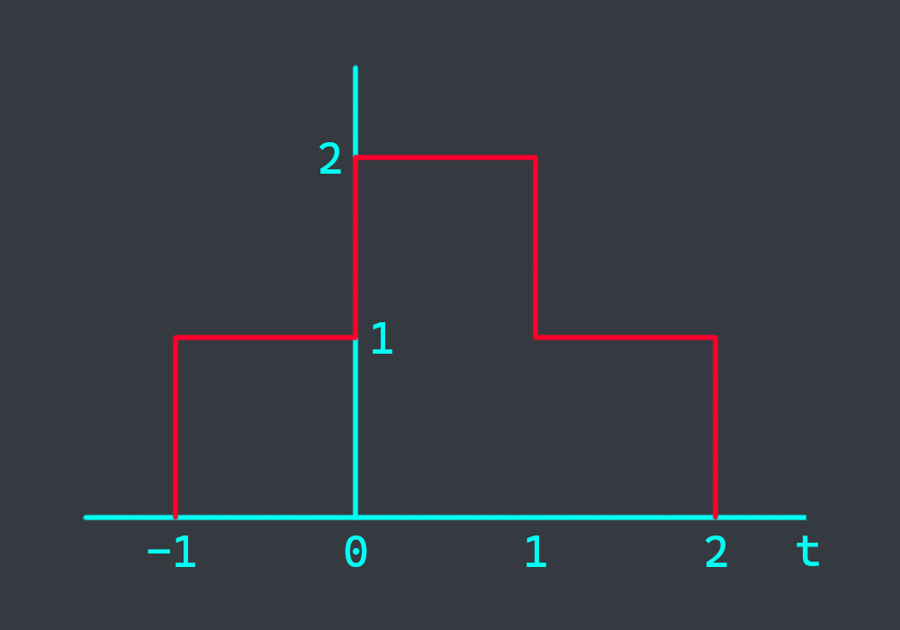

# 1. Signals
Using the discrete-time signals $x_1[n]$ and $x_2[n]$ given below

{}

{}

represent each of the following signals by a graph and by a sequence of numbers.
- $y_1[n] = x_1[n] + x_2[n+1]$
- $y_2[n] = 2x_1[n+2] + x_2[1-n]$
- $y_3[n] = x_1[2n] \times x_2[n-2]$

# 2. System
Consider an LTI system whose response to the signal $x_1(t)$ is the signal $y_1(t)$ given below

{}

{}

Determine and sketch carefully the response to the following input

{}

{}

# 3. Convolution sum
Consider the evaluation
$$y[n] = x_1[n] \ast x_2[n] \ast x_3[n]$$
where

$$\begin{aligned}
x_1[n] &= (0.5)^n u[n] \\\
x_2[n] &= u[n+3] \\\
x_3[n] &= \delta[n] - \delta[n-1]
\end{aligned}$$

- Evaluate $x_1[n] \ast x_2[n]$.
- Evaluate $x_2[n] \ast x_3[n]$.
- Calculate $y[n]$.